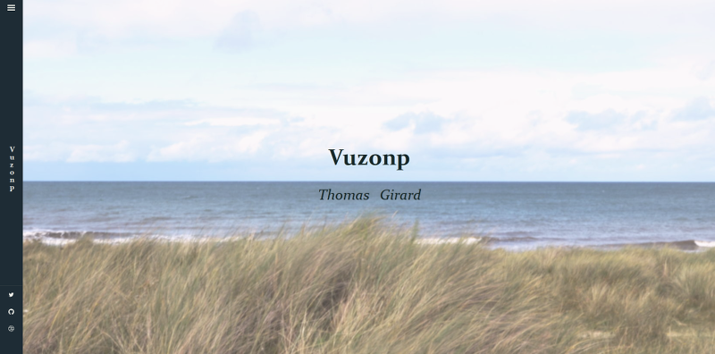

# Æris Hugo template

__Warning, this template is actually a _work in progress_. Please, do not use it in production !__

Æris is a template for the __[Hugo static website engine](http://gohugo.io) originally intended to [old.thomasgirard.fr](http://old.thomasgirard.fr). This template is under MIT License.__



## Goals
- Responsive design (multi devices)
- Speed on loading times
- Accessibility
- SEO by [microdata](https://schema.org/)
- Multimedia content management

### Technical Specifications

- IE 10+, Firefox 34+, Chrome 39+, Safari 7+
- HTML5, CSS3, JS (ES5+)
- WCAG AA
- Mobile first

## How to install

With terminal, go to your Hugo's project and clone this repository to an _./themes/aeris/_ diretory:

```sh
$ cd ./my/website/
$ git clone https://github.com/vuzonp/hugo-theme-aeris ./themes/aeris
```

Then update your _config.toml_ file:

```toml
theme = "aeris"
```

You can now preview or compile your website with your new template:

```sh
$ hugo server
```

## Configuration
The Æris template use some specific settings. This options are to add to your config file:


- __Paginate (int):__ The Hugo paginator variable;
- __[params] author (str):__ the author's website name;
- __[params] subtitle (str):__ Subtitle of your website (will appears in the banner);
- __[params] twitter (str):__ Twitter account of your website (will appears in the sidebar);
- __[params] github (str):__ Github account of your website (will appears in the sidebar);


_./config.toml example:_
```toml
baseurl = "http://www.thomasgirard.fr"
languageCode = "fr-fr"
title = "Vuzonp"
theme = "aeris"
copyright = "Thomas Girard, tous droits réservés."
description = "Site personnel de Thomas Girard sur l'univers web, linux et les arts visuels."
Paginate = 8

[permalinks]
    page = "/:title/"

[params]
	author = "Thomas Girard"
	subtitle = "Thomas Girard"

	# Social links
	#--------------------------------------------

	twitter = "@vuzonp"
	github = "vuzonp"
	dribble = "vuzonp"

```

## Customization
<p id="custom">For customize the template, Æris attemps to automatically load the stylesheet `./static/css/custom.css` during compilation.</p>

### Translation
To translate Æris in another language, simply copy the `./themes/aeris/data/locale.toml` to `./data/locale.toml`. Then, open this new file and edit it in your language. For example, in www.thomasgirard.fr, the website is in french, so my file looks like this:

```toml
#data/locale.toml: FR-fr
ascend = "remonter en haut de la page"
backToHome = "revenir à l'accueil"
createdBy = "réalisé par"
dateFormat = "02/01/2006"
footerNavigation = "navigation secondaire"
home = "accueil"
issue = "remontée de bugs (contact technique)"
lastUpdate = "dernières publications"
newerPosts = "articles récents"
olderPosts = "articles précédents"
previewDrafts = "aperçu du travail en cours"
primaryNavigation = "navigation principale"
published = "publié le"
readmore = "lire la suite"
readingTime = "temps de lecture estimé"
sitename = "nom du site"
skipContent = "accéder directement au contenu"
template = "template"
using = "utilise le générateur de site"
```

#### Multilingualism
Æris does not allow the creation of multilingual sites. But you can publish posts in several languages by indicating in the header of yours markdown files the parameter `lang = "de"` (here for _deutch_ language in toml format).


## Externalization of Static Resources
For various technical and practical reasons, static data has been moved to an [external git repository](https://github.com/vuzonp/aeris-static).

### Use It Like a Content Delivery Network
The static data repository is used like a _CDN_ by the template ([see more informations about this technique](http://code.lancepollard.com/github-as-a-cdn/) or [the point of view of Github about it](http://web.archive.org/web/20110320210735/http://support.github.com/discussions/site/3198-using-github-pages-as-cheap-cdn)).

- Url pattern of the CDN is: _`https://vuzonp.github.io/aeris-static/dist/type/resource.ext`_
- CSS file: `https://vuzonp.github.io/aeris-static/dist/css/aeris.min.css`
- JS file: `https://vuzonp.github.io/aeris-static/dist/js/aeris.min.js`

### Host Yourself
You can [override the default styles with custom.css](./#custom) file, but if you want directly edit the static content, you can also install it in follow the  [static-aeris repository instructions](https://github.com/vuzonp/aeris-static/blob/master/Readme.md).

After, edit the head.html and footer.html layout for change the urls by yours:

_layouts/partials/head.html:_
```html
{{ $burl := (print .Site.BaseUrl) }}
{{ if in $burl "localhost"}}<link rel="stylesheet" href="http://0.0.0.0:8080/css/aeris.min.css" />
{{ else }}<link rel="stylesheet" href="https://vuzonp.github.io/aeris-static/dist/css/aeris.min.css" />{{ end }}
```

_layouts/partials/footer.html:_
```html
{{ $burl := (print .Site.BaseUrl) }}
{{ if in $burl "localhost"}}<script src="http://0.0.0.0:8080/js/aeris.min.js"></script>{{ else }}
<script src="https://vuzonp.github.io/aeris-static/dist/js/aeris.min.js"></script>{{ end }}
```
