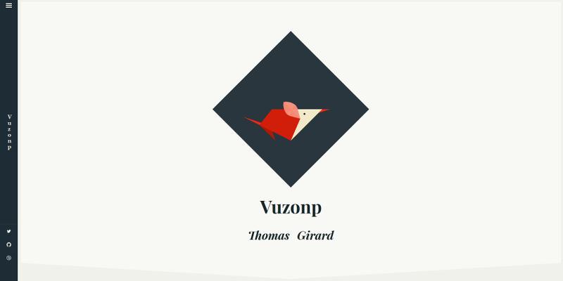

# Æris

__ Warning, this template is actually a _work in progress_. Please, do not use it in production !__

__Template for [hugo](http://gohugo.io).__


_This project is initially writed for the [vuzonp](http://www.thomasgirard.fr/) website_

## Goals

- Multi-devices support
- light / quick
- Accessibility (_WCAG 2 AA compatibility_)
- _Rolling release_ model

## How to install

With terminal, go to your Hugo's project and clone this repository to an _./themes/aeris/_ diretory:

```sh
$ cd ./my/website/
$ git clone https://github.com/vuzonp/hugo-theme-aeris ./themes/aeris
```

Then update your _config.toml_ file:

```toml
theme = "aeris"
```

You can now preview or compile your website with your new template:

```sh
$ hugo server
```
